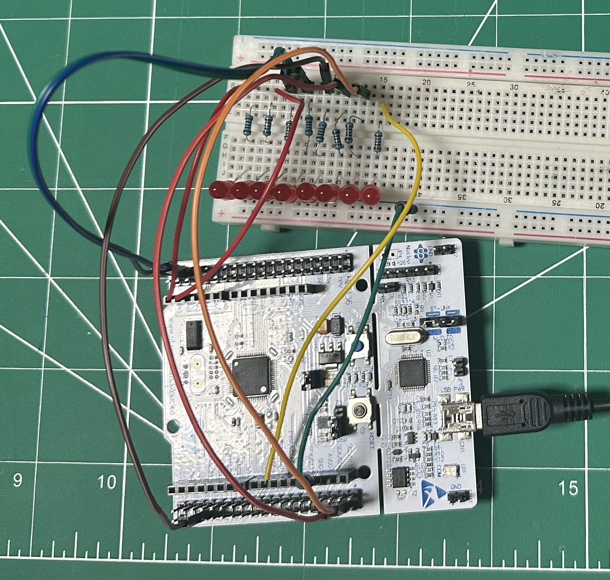

# Moving LEDs Project - STM32F446RE

A simple project that demonstrates sequential LED animation using GPIO pins PC0-PC7 on the STM32F446RE Nucleo board.

## Hardware Setup

- 8 LEDs
- 8 x 220Ω resistors
- Breadboard
- Jumper wires
- STM32F446RE Nucleo board

## Pin Connections
| Port Pin | Header Pin |
|----------|------------|
| PC0      | CN8-38    |
| PC1      | CN8-36    |
| PC2      | CN8-35    |
| PC3      | CN8-37    |
| PC4      | CN9-34    |
| PC5      | CN9-6     |
| PC6      | CN9-4     |
| PC7      | CN9-19    |

Ground connection: CN8-19/20 (GND)

## Behavior
- LEDs light up one at a time in sequence
- 250ms delay between each LED transition
- Pattern repeats continuously

## Build and Run
1. Open project in STM32CubeIDE
2. Build in Release configuration
3. Flash the board by dragging MovingLEDs.bin to the Nucleo board
